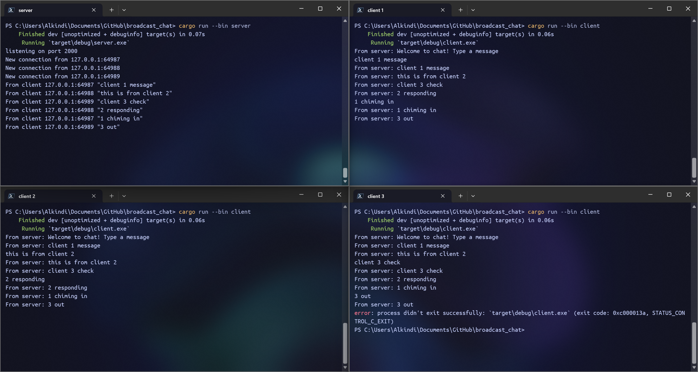
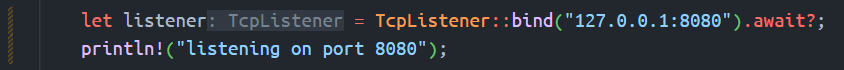
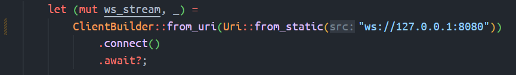
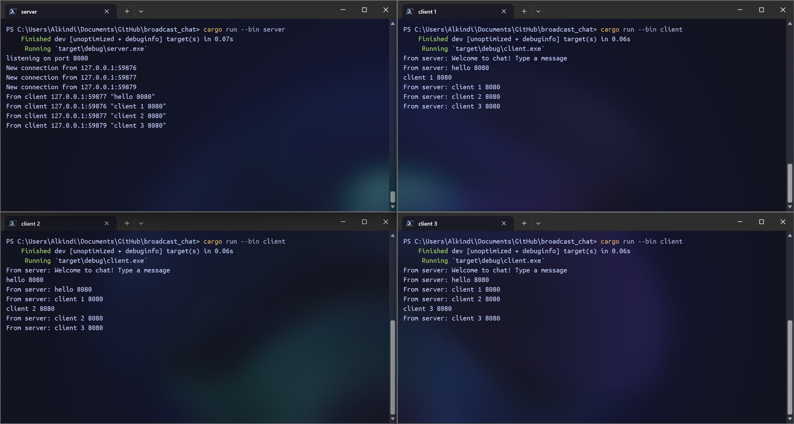
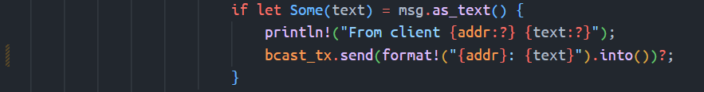
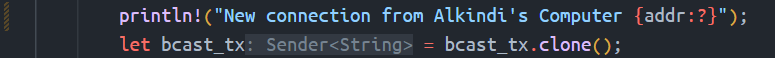
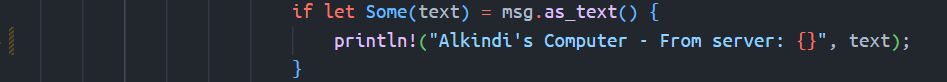
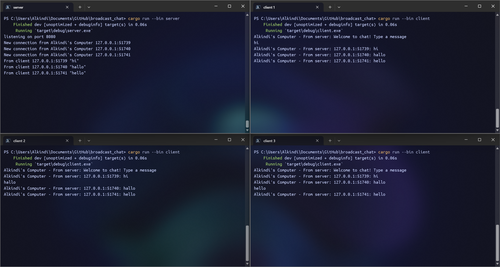

# Tutorial 10 - Part 2: Broadcast Chat

## 2.1 Original code of broadcast chat

This setup involves 4 terminal tabs, 1 running the server using `cargo run --bin server` first and the other 3 running the client using `cargo run --bin client` afterwards.
When a client connects, the server prints their IP address and sends the message `From server: Welcome to chat! Type a message`.
Connected clients can type messages in the terminal tab and hit Enter to send it to the server. Everytime a client receives a message from a server, it will print it.
For every message the server receives from a client, it will print the IP address alongside the message and then resends the message to all connected clients.

## 2.2 Modifying the websocket port

Other than `src/bin/client.rs`, we will also need to modify `src/bin/server.rs` to listen to port `8080` so the program still runs properly. Here are the changed lines:

`src/bin/server.rs`  

`src/bin/client.rs`  

We can see they both use the same websocket protocol which is handled by `tokio_websockets`.
This library helps us with defining websockets to make sure both the server and the client uses the same protocol so they can communicate properly.
If we run the same setup as defined before, we can see that the program still works.

## 2.3 Small changes. Add some information to client

Following changes are made:

`src/bin/server.rs`  

`src/bin/client.rs`  

The server will now include `Alkindi's Computer` in the client connection message text.
It also sends the message's sender IP address and port alongside its text content when resending the message to all client.
The client will now include `Alkindi's Computer -` in the server message text.
Because of the changes from the server, it will also display the original sender's IP address and port when printing the server message text.

